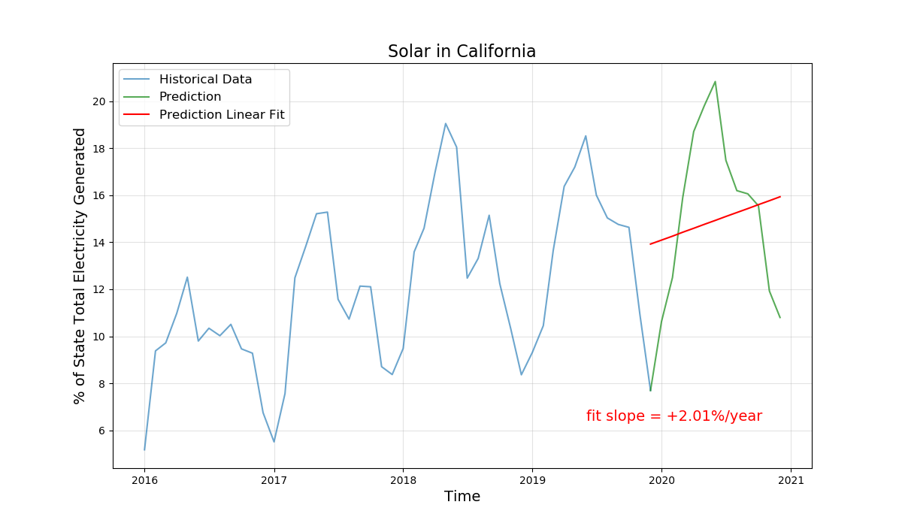
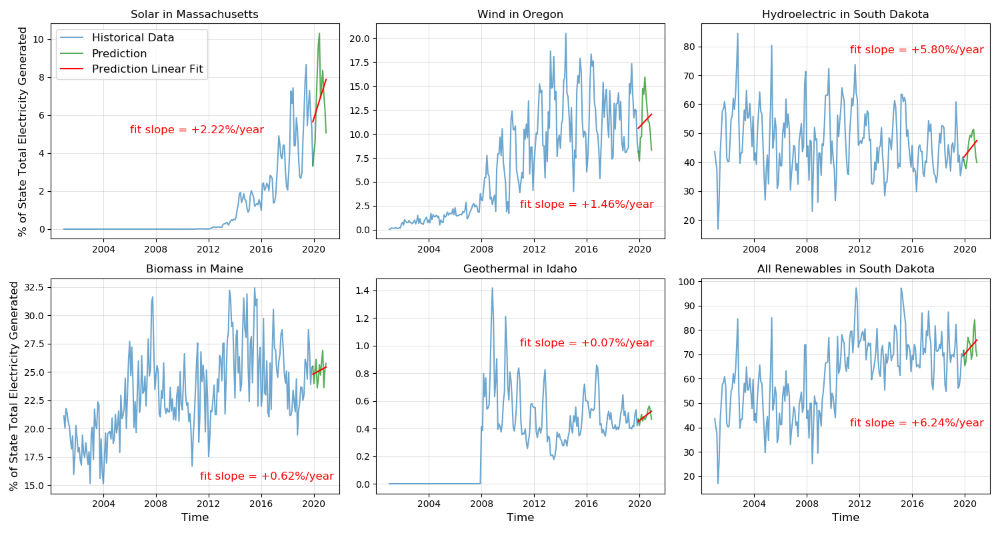

# 
Predicting States Renewable Energy Production

#### 
by Alex Diaz-Clark

A project that includes training and evaluating various models used to predict the percentage of electricity generated from renewable resources for each state. 

## Background

Most states claim to be making efforts to shift their resources used to produce electricity away from fossil fuels and other non-renewable resources. This project aims to identify the states which have had success in their efforts, and forecast the percentage of electricity generated from renewable resources for each state for the year 2020. 

The goals of this project are as follows:
* Develop a time-series forecasting model to be used for predicting the percentage of electricity generated from renewable resources for each state based on monthly data from the years 2001-2019.   
* Use the model to predict the monthly percentage of electricity generated from renewable resources for each state for the year 2020.
* Analyze the 2020 forecasts to identify which states are poised to increase it's percentage of electricity generated from each renewable resource in 2020.

## The Data

The dataset used for this project was downloaded from the Energy Information Administration (EIA), a part of the US Department of Energy. The dataset can be downloaded by clicking [here](https://www.eia.gov/electricity/data/state/generation_monthly.xlsx "Download dataset from EIA"), or navigating to the [EIA's Detailed State Data page for electricity](https://www.eia.gov/electricity/data/state/ "EIA webpage").

The dataset contains data for every state's electricity generation aggregated by state, month, energy source, and type of producer. Contained is the amount of electricity generated in Megawatt-hours for every month for the years between 2001 and 2019 (inclusive of both). The total amount of electricity generated (all types of producers) was aggregated by state, month, and energy source after it was downloaded. Next, the data from each energy source, for each state was transformed to be a percentage of that states total electricity generation. As an example, the time series for the percentage of total electricity generation that is from renewable resources for California is shown below. 

After transforming the data to a percentage of the state's total electricity generated, an SQL database was created in a PostgreSQL server running in a Docker container. The SQL database was populated with the data awaiting future retrieval.

The script which executes all of the data processing, creates the SQL database, and populates the SQL database can be found at '/src/database.py' in this repository.

The functions used to retrieve the data from the SQL database at will can be found at '/src/from_SQL.py' in this repository. Note that all scripts in this repository have been published with a generic username and password for connecting to the PostgreSQL database. These details will have to be customized to run the scripts on your local machine.

## Train/Test Split

The image below uses California's electricity generated from solar energy to demonstrate the train/test split used for comparing the finalized models.

One of the final goals of this project is to predict each time-series for the year 2020, based on the data from 2001-2019. This was considered when choosing the train data to be the 2001-2018 data and the test data to be the 2019 data, in order to select the model that perform best under similar conditions. 

Also taken into consideration was the limited number of data points available, only 228 monthly data points for each time-series. The length of the train data was maximized in order to provide as many training samples as possible, particularly with consideration to the Long Short Term Memory (LSTM) neural networks. 

## Models

The following models were tuned and compared to each other:

* Baseline: 

The baseline model is a simply a linear regression fit to the 2001-2018 data. The continuation of the fit linear trend into the year 2019 is used as the 2019 predictions. 

* Triple exponential smoothing (Holt-Winters):

The next model used is the Holt-Winters method of triple exponential smoothing, which combines three smoothing equations to create its forecast, one for overall smoothing, one for trend smoothing, and one for seasonal smoothing. The ExponentialSmoothing() class from Python's statmodels module was used to fit the model using 2001-2018 data and predicting 2019 for each time series. The parameter indicating seasonal period was kept constant at 12 (representing the monthly periods) while the following hyper-parameters were tuned: trend (additive or multiplicative), seasonal (additive or multiplicative), and damped trend component (True or False). Using root-mean-square error on the 2019 predictions, in combination with visual inspection (more on this later) the final Holt-Winters model selected has and additive trend type, an additive seasonal type, and a damped trend component.

* Univariate LSTM Neural Network:

The next model used is the univariate LSTM neural network, using only the 2001-2018 time-series of the renewable resource in question to predict it's 2019 data. The many-to-many approach to model training was used and the target variables is the next 12 periods. The following period options were considered for selecting features to be used for windowizing training samples: 12 periods, 18 periods, 24 periods, 30 periods, and 36 periods. The final choice for windowizing training samples was to use the previous 24 periods as the features and the next 12 periods as the target. Different layer configurations were also tuned and the final neural network contains one hidden layer (32 nodes), one dropout layer (dropping 20%), another hidden layer (32 nodes) and an output layer with a linear activation function. The network was compiled using mean-squared-error as the loss function and RMSprop as the optimizer. 

* Multivariate LSTM Neural Network

The final model used is the multivariate neural network. The model structure is the same as the Univariate version, except the input tensor contains the time-series for all 11 energy sources (both renewable and non-renewable) instead of only the time-series for the renewable energy source in question. This is an attempt to capture information that may exist in the relationships between the time-series for the different energy sources. 

## Evaluation Metric

The root-mean-squared error (RMSE) on the predicted test data was used as the main evaluation metric to choose between the models. This was combined with a visual inspection of the predictions. The reason for this necessity is highlighted by the following example. Below is a table containing the RMSE for predicting California's 2019 Energy time-series for the different renewable energy sources (the final column is the average of each column's values when normalized to the Baseline prediction's RMSE).

| Model | Solar RMSE | Wind RMSE | Hydroelectric RMSE | Biomass RMSE | Geothermal RMSE | **Normalized Avg** |
| --- | :---: | :---: | :---: | :---: | :---: | :---: |
| Baseline | 0.0554 | 0.0124 | 0.0975 | 0.0045 | 0.0073 | **1.0** |
| Holt-Winters | 0.0216 | 0.0129 | 0.0991 | 0.0016 | 0.0085 | **0.79** |
| LSTM Univariate | 0.0274 | 0.0161 | 0.0716 | 0.0034 | 0.0070 | **0.82** |
| LSTM Multivariate | 0.0291 | 0.0190 | 0.0982 | 0.0044 | 0.0088 | **1.05** |

When examining the RMSE for predictions on electricity generated from Wind Energy, the table leads you to believe that the baseline model was the best predictor, because it has the lowest RMSE score. However, visual inspection of the actual predictions, shown below, paints a different picture. 

The baseline model has the lowest RMSE score for wind energy, however, it obviously predicts none of the seasonal trend present in the 2019 data. All three of the other models capture some of the seasonal trend, with the Holt-Winters method appearing to do the best job. What is happening is that the RMSE score punishes large errors that occur when the prediction is one or two periods late in predicting the sharp rises and falls of the actual data. This is the reason, that a visual inspection of the predictions was required to confirm the RMSE scores. 

While LSTM neural networks are very powerful tools, it seems that there simply aren't enough data points to truly harness that power. With the method used for this application of windowizing the training data, the LSTM networks are only being trained on 157 samples before attempting to predict the 2019 time-series. 

Using RMSE on the 2019 predictions in combination with visually inspecting predictions, the Holt-Winters method of triple exponential smoothing is the model selected to move forward with the 2020 predictions.

## Analyzing 2020 Predictions

The goal of this project once 2020 forecasts were made, is to identify which states are poised to increase it's percentage of electricity generated from each renewable resource in 2020. The method used for this analysis is described below:
* Using ordinary least squares regression, fit a linear trend to each predicted 2020 time-series.
* Find the slope of the linear fit (in units of percentage-points/year)
* Compare the slopes of the linear fits to identify the states with the greatest slopes to be the predicted leaders for increasing it's percentage of electricity generated from each renewable resource in 2020.

To demonstrate the process, below is the forecasted 2020 time-series for California's electricity generated from solar energy.

## Results

The image below shows the states identified as the leaders for increasing it's percentage of electricity generated from each renewable resource in 2020.

The tables below identifies the top 3 states with respect to increasing it's percentage of electricity generated from each renewable resource in 2020.

| State | Solar Fit Slope  |
| --- | :---: |
| Massachusetts | +2.2 %-points/year |
| California | +2.0 %-points/year |
| Nevada | +1.2 %-points/year |

| State | Wind Fit Slope  |
| --- | :---: |
| Oregon | +1.5 %-points/year |
| North Dakota | +0.64 %-points/year |
| South Dakota | +0.44 %-points/year |

| State | Hydroelectric Fit Slope  |
| --- | :---: |
| South Dakota | +5.8 %-points/year |
| Ohio | +0.064 %-points/year |
| Indiana | +0.057 %-points/year |

| State | Biomass Fit Slope  |
| --- | :---: |
| Maine | +0.62 %-points/year |
| New Hampshire | +0.31 %-points/year |
| Idaho | +0.28 %-points/year |

| State | Geothermal Fit Slope  |
| --- | :---: |
| Indiana | +0.074 %-points/year |
| Oregon | +0.034 %-points/year |

| State | All Renewables Fit Slope  |
| --- | :---: |
| South Dakota | +6.2 %-points/year |
| Massachusetts | +1.2 %-points/year |
| New Jersey | +0.38 %-points/year |

## Conclusions

My takeaways from this project are as follows:
* Many states have drastically increased their share of electricity generation from renewable resources over the period from 2001-2019.
* While LSTM neural networks are powerful tools  for forecasting time-series data, they require more than approximately 150 training samples to outperform classic methods such as Holt-Winters.
* Only 6 states' forecasted 2020 time-series for electricity generated from all renewable energy sources have a positive slope. It's possible that 2020 will bring a downturn in overall electricity generated from renewable sources.
* Only 2 states' forecasted 2020 time-series for electricity generated from geothermal energy sources have a positive slope, and 46 states do not produce electricity using geothermal energy, making it the energy source most likely to see a decrease in 2020. 
* 27 states' forecasted 2020 time-series for electricity generated from biomass energy sources have a positive slope, making it the energy source most likely to see an increase in 2020. 

## Next Steps

There are a few ideas I would like to explore to improve this project:
* Find possibly-related exogenous features to be used in making predictions.
* Continue tuning the Neural Network and try to develop a better predicting model. 
* Create an interactive data dashboard where users can explore historical trends and predictions.

## Acknowledgments

I would like to thank the Energy Information Administration for making this data publicly available and accessible. I would also like to thank the instructors and staff of Galvanize -- San Francisco's Data Science Immersive Program for their guidance in developing this project.
